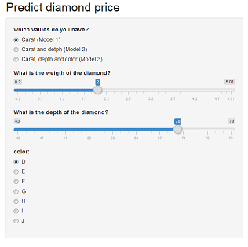
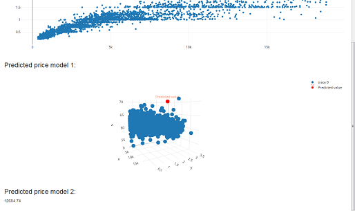

```{r setup, include=FALSE}
knitr::opts_chunk$set(echo = FALSE)
```

## Presentation

In this application you will be able to predict the price of a diamond based on the combination of three different attributes:

- Carats
- Carats and depth
- Carats, depth and color

## Options

You will be able to select between three differente prediction models, depending on the data you have. For each attribute you will be able to define the value easily.




## Prediction result

Every time you change a value the outcome is predicted using the choosen model, and the resutl is printed in a plot.




## Link

If you want to test the application, just click in the url below:


[Diamonds](https://txep.shinyapps.io/Diamonds/)

